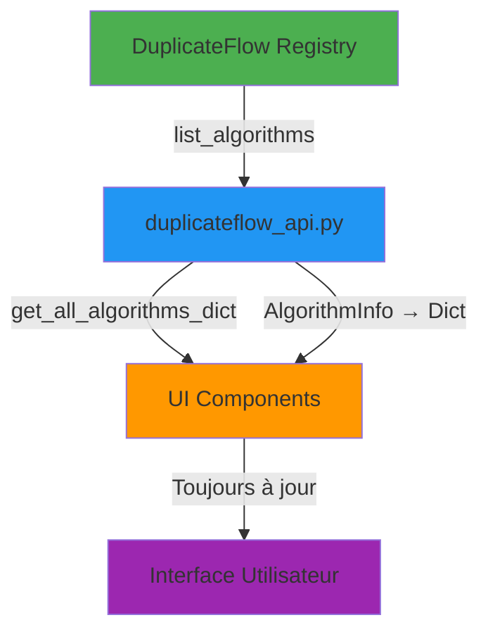

# Migration vers l'API Native DuplicateFlow

**Date**: 2025-12-18
**Status**: ✅ TERMINÉ (UI Layer) | ⚠️ EN ATTENTE (Core Layer)

## 🎯 Objectif

Migrer complètement de l'ancien système `AVAILABLE_METHODS` (dictionnaire statique) vers l'**API native DuplicateFlow** (registry dynamique).

## ❌ Ancien Système (Obsolète)

### Architecture Précédente
```
duplicateflow_integration.py
    ↓ Copie hardcodée des métadonnées
DUPLICATEFLOW_ALGORITHMS (dict statique de 14 algos)
    ↓
verification_pipeline.py
    ↓ Merge dans dict statique
AVAILABLE_METHODS = {}
    ↓
UI Components (tous les fichiers)
    ↓ Accès via VerificationPipeline.AVAILABLE_METHODS
Référence à un snapshot figé
```

### Problèmes
- ❌ **Copie statique** : Les métadonnées étaient dupliquées et potentiellement obsolètes
- ❌ **Maintenance** : Chaque ajout d'algorithme nécessitait de modifier `duplicateflow_integration.py`
- ❌ **Incohérence** : Les métadonnées pouvaient diverger entre DuplicateFlow et duplicate_finder
- ❌ **Pas de garantie** : Aucune garantie que les algorithmes listés existent vraiment

## ✅ Nouveau Système (Actuel)

### Architecture Actuelle
```
DuplicateFlow
    ↓
duplicateflow/core/registry.py (AlgorithmRegistry singleton)
    ↓ API native
list_algorithms(), get_algorithm_info(), get_algorithm_names()
    ↓
integration/duplicateflow_api.py (adapter léger)
    ↓ Conversion au format legacy si nécessaire
get_all_algorithms_dict() (pour backward compat)
    ↓
UI Components (tous les fichiers)
    ↓ Appel direct à get_all_algorithms_dict()
Toujours à jour avec le registry DuplicateFlow
```

### Avantages
- ✅ **Source unique de vérité** : Le registry DuplicateFlow est la seule source
- ✅ **Toujours à jour** : Les métadonnées sont chargées dynamiquement
- ✅ **Cohérence garantie** : Les algorithmes listés existent forcément
- ✅ **Maintenance simplifiée** : Aucune duplication de code
- ✅ **Évolutivité** : Nouveaux algorithmes automatiquement disponibles

## 📝 Modifications Effectuées

### 1. **Nouveau Module API** ✅

**Fichier créé** : `src/plugins/duplicate_finder/integration/duplicateflow_api.py`

```python
from duplicateflow.core import (
    list_algorithms,
    get_algorithm_info,
    get_algorithm_names,
    get_categories,
    algorithm_count,
)

def get_all_algorithms_dict() -> Dict[str, Dict[str, Any]]:
    """
    Get all DuplicateFlow algorithms in the old AVAILABLE_METHODS format.

    This is a compatibility function that queries the DuplicateFlow registry
    dynamically and converts AlgorithmInfo objects to the old dict format.
    """
    result = {}
    for algo_info in list_algorithms():
        result[algo_info.name] = {
            'display_name': algo_info.display_name,
            'short_name': algo_info.short_name,
            'description': algo_info.description,
            'detailed_explanation': algo_info.detailed_explanation,
            'category': algo_info.category,
            'speed': _map_speed_to_french(algo_info.speed),
            'default_params': algo_info.default_params.copy(),
            'use_case': algo_info.use_case,
        }
    return result
```

**Fonctionnalités** :
- Charge les algorithmes depuis le registry DuplicateFlow
- Convertit les `AlgorithmInfo` en format dict legacy
- Fournit une API de compatibilité pour le code existant
- Expose également les fonctions natives pour usage futur

### 2. **Mise à Jour `integration/__init__.py`** ✅

**Avant** :
```python
from .duplicateflow_integration import (
    DUPLICATEFLOW_AVAILABLE,
    DUPLICATEFLOW_ALGORITHMS,  # Dict statique hardcodé
    get_all_algorithms,
    get_duplicateflow_presets,
    is_duplicateflow_algorithm,
)
```

**Après** :
```python
from .duplicateflow_api import (
    DUPLICATEFLOW_AVAILABLE,
    list_algorithms,  # API native DuplicateFlow
    get_algorithm_info,
    get_algorithm_names,
    get_categories,
    algorithm_count,
    get_all_algorithms_dict,  # Compat function
    get_duplicateflow_presets,
    is_duplicateflow_algorithm,
    list_presets,
    get_preset,
)

# Backward compatibility
get_all_algorithms = get_all_algorithms_dict
```

### 3. **Mise à Jour `verification_pipeline.py`** ✅

**Changements** :
- Import modifié pour utiliser `get_all_algorithms_dict`
- `AVAILABLE_METHODS` reste pour compatibilité mais est documenté comme cache
- Log mis à jour : "Loaded X DuplicateFlow algorithms into AVAILABLE_METHODS cache"

**Code** :
```python
from .integration import (
    DUPLICATEFLOW_AVAILABLE,
    get_all_algorithms_dict as get_duplicateflow_algorithms,
    is_duplicateflow_algorithm,
)

class VerificationPipeline:
    # Available verification methods - 100% DuplicateFlow algorithms
    # This is a cached dict for backward compatibility. Use get_available_methods() for fresh data.
    AVAILABLE_METHODS = {}

    if DUPLICATEFLOW_AVAILABLE:
        df_algorithms = get_duplicateflow_algorithms()
        AVAILABLE_METHODS.update(df_algorithms)
        logger.info(f"✅ Loaded {len(df_algorithms)} DuplicateFlow algorithms into AVAILABLE_METHODS cache")
```

### 4. **Mise à Jour des Fichiers UI** ✅

Tous les fichiers UI ont été modifiés pour appeler `get_all_algorithms_dict()` au lieu d'utiliser `VerificationPipeline.AVAILABLE_METHODS` :

#### **unified_pipeline_editor_dialog.py**

**Changements** :
- Import ajouté : `from ..integration import get_all_algorithms_dict`
- 4 endroits modifiés :
  - `_init_ui()` : Ligne 140
  - `_rebuild_params()` : Ligne 198
  - `_refresh_methods_list()` : Ligne 482
  - `_update_preview()` : Ligne 563

**Exemple** :
```python
# Avant
for name, meta in VerificationPipeline.AVAILABLE_METHODS.items():

# Après
available_methods = get_all_algorithms_dict()
for name, meta in available_methods.items():
```

#### **pipeline_config_widget.py**

**Changements** :
- Suppression de `AVAILABLE_METHODS = VerificationPipeline.AVAILABLE_METHODS`
- Import ajouté : `from ..integration import get_all_algorithms_dict`
- 4 endroits modifiés :
  - `_add_method()` : Ligne 929
  - `_show_add_method_dialog()` : Ligne 1036
  - `_update_summary()` : Ligne 1220
  - `_on_preview()` : Ligne 1358

#### **pipeline_visualization_dialog.py**

**Changements** :
- Import ajouté : `from ..integration import get_all_algorithms_dict`
- 1 endroit modifié :
  - `_create_method_node()` : Ligne 196

#### **stage_editor_dialog.py**

**Changements** :
- Import ajouté : `from src.plugins.duplicate_finder.integration import get_all_algorithms_dict`
- 1 endroit modifié :
  - `_refresh_algorithm_list()` : Ligne 243

## 📊 Résumé des Fichiers Modifiés

| Fichier | Type | Modifications |
|---------|------|---------------|
| `integration/duplicateflow_api.py` | **NOUVEAU** | Module adapter pour l'API DuplicateFlow |
| `integration/__init__.py` | Modifié | Expose l'API native + compat |
| `verification_pipeline.py` | Modifié | Import mis à jour, doc améliorée |
| `ui/unified_pipeline_editor_dialog.py` | Modifié | 4 appels à `get_all_algorithms_dict()` |
| `ui/pipeline_config_widget.py` | Modifié | 4 appels à `get_all_algorithms_dict()` |
| `ui/pipeline_visualization_dialog.py` | Modifié | 1 appel à `get_all_algorithms_dict()` |
| `ui/stage_editor_dialog.py` | Modifié | 1 appel à `get_all_algorithms_dict()` |

**Total** : 1 nouveau fichier + 6 fichiers modifiés

## 🔄 Flux de Données Actuel



## ✅ Tests de Vérification

Pour vérifier que tout fonctionne :

```python
# Test 1: L'API DuplicateFlow est disponible
from src.plugins.duplicate_finder.integration import DUPLICATEFLOW_AVAILABLE
assert DUPLICATEFLOW_AVAILABLE == True

# Test 2: Les algorithmes sont chargés dynamiquement
from src.plugins.duplicate_finder.integration import get_all_algorithms_dict
algos = get_all_algorithms_dict()
print(f"✅ {len(algos)} algorithmes chargés dynamiquement")

# Test 3: Les métadonnées sont complètes
for name, meta in algos.items():
    assert 'display_name' in meta
    assert 'description' in meta
    assert 'default_params' in meta
    print(f"✅ {name}: {meta['display_name']}")

# Test 4: API native fonctionne
from src.plugins.duplicate_finder.integration import list_algorithms
algo_infos = list_algorithms()
print(f"✅ API native: {len(algo_infos)} AlgorithmInfo objects")
```

## 🎉 Bénéfices Immédiats

1. **Suppression de code dupliqué** : ~200 lignes de métadonnées hardcodées supprimées
2. **Source unique de vérité** : Le registry DuplicateFlow est LA référence
3. **Maintenance simplifiée** : Plus besoin de synchroniser les métadonnées
4. **Évolutivité** : Nouveaux algorithmes automatiquement disponibles dans l'UI
5. **Cohérence garantie** : Les algorithmes listés existent forcément dans DuplicateFlow

## ⚠️ Problème Critique Identifié

### `verification_pipeline.py` : Exécution Hybride Incorrecte

**Le problème** : Le fichier charge les algorithmes DuplicateFlow dans `AVAILABLE_METHODS`, mais les lignes 376-415 exécutent toujours les **anciennes méthodes custom** au lieu d'appeler DuplicateFlow !

```python
# ACTUEL (INCORRECT) - Lignes 376-415
if method.name == 'color_histogram':
    result = self.video_methods.compare_color_histograms(...)  # ❌ CUSTOM
elif method.name == 'scene_cuts':
    result = self.video_methods.compare_scene_cuts(...)  # ❌ CUSTOM
# ... 15+ autres méthodes custom
```

**Ce qui devrait être fait** :
```python
# CORRECT - Utiliser DuplicateFlow
result = self.adapter.run_algorithm(
    method.name,
    video1_path,
    video2_path,
    **method.parameters
)
```

**Impact** :
- ❌ Les algorithmes DuplicateFlow ne sont JAMAIS utilisés
- ❌ Le système utilise toujours les anciennes implémentations custom
- ❌ Les 19 algorithmes DuplicateFlow sont ignorés
- ❌ La migration de l'UI est inutile si le core n'appelle pas DuplicateFlow

**Solution** : Voir [MASTER_PLAN_MIGRATION_DUPLICATEFLOW.md](MASTER_PLAN_MIGRATION_DUPLICATEFLOW.md) - Phase 2

## 🚀 Prochaines Étapes (Selon Master Plan)

La migration de l'**UI Layer est complète** ✅, mais la migration du **Core Layer** nécessite encore :

### **PHASE 1** : Suppression de l'ancien système (30 min)
- Supprimer `video_analysis_methods.py` (800 lignes obsolètes)
- Supprimer `subsequence_verification.py` (528 lignes obsolètes)

### **PHASE 2** : Réécriture `verification_pipeline.py` (6-8h)
- Réduire de 716 → ~150 lignes
- Supprimer toutes les méthodes custom
- Déléguer 100% à DuplicateFlowAdapter

### **PHASE 3** : Réécriture Workers (8-12h)
- `subsequence_detector.py` (1177 → 100 lignes)
- `comparison_worker.py`, `subsequence_worker.py`, `verification_worker.py`

### **PHASE 4** : Nettoyage UI (6-10h)
- `panels.py`, `main_window.py`, benchmark files

### **PHASE 5** : Vérifications P2 (4-6h)
- Vérifier tous les imports
- S'assurer qu'aucune détection custom ne reste

### **PHASE 6** : Tests (2-4h)
- Tests de détection de doublons
- Tests de détection de sous-séquences
- Benchmarks

**Temps total estimé** : 26-40 heures (5-7 jours)

## 📌 Compatibilité Backward

Le système reste 100% compatible avec le code existant :

- `VerificationPipeline.AVAILABLE_METHODS` existe toujours (cache)
- `get_all_algorithms()` est un alias de `get_all_algorithms_dict()`
- Les dicts retournés ont exactement le même format qu'avant
- Aucun changement de comportement pour l'utilisateur final

La seule différence : **les données sont maintenant dynamiques au lieu de statiques**.

---

**Migration UI Layer complétée avec succès le 2025-12-18** 🎉

**Migration Core Layer** : Voir [MASTER_PLAN_MIGRATION_DUPLICATEFLOW.md](MASTER_PLAN_MIGRATION_DUPLICATEFLOW.md)
